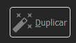

# Series

Todos los documentos en Winmotor se clasifican por series. Cada serie implica un contador para los documentos que incluya y son ilimitadas: se pueden crear tantas series por tipo de documento como se desee.

.png>)

Los campos a rellenar al crear una serie son:

**1.- Código:** No hay que rellenarlo, lo hace el programa automáticamente. Será el identificador interno para la serie

**2.- Referencia:** Su tamaño máximo es de 6 caracteres alfanuméricos. Se recomienda usar abreviaturas que identifiquen claramente el tipo de documento sobre el que se utiliza la serie de manera que al visualizar documentos en el programa podamos diferenciar claramente de qué tipo se trata ( FV- Facturas de ventas, AV – Albarán de ventas, AC- Albarán de compras etc). En el ejemplo anterior hemos añadido a FV el carácter “G” para identificar que será la serie para facturas de ventas “General”.

* Serie abono: Identifica si la serie que se va a grabar será utilizada para abonos de documentos. Es un campo tipo “check” y aparecerá en el caso de dar de alta series de albaranes o facturas.
* Serie activa: Por defecto aparece marcada, pero en el momento en que se desmarque la serie dejará de poder utilizarse en documentos.
* Empresa: El programa presenta por defecto la empresa activa en parámetros, no hay que rellenarlo.
* Tipo de documento: Es el tipo de documento sobre el que se podrá utilizar la serie. Pulsando en el botón de la derecha aparecerá un desplegable con todos los tipos de documentos disponibles en la distribución para aplicar a la serie.
* Formato nombre: El programa calcula este dato al aceptar el alta de la serie. Será el identificador final de cada documento generado dentro de la serie y por defecto contendrá además de la “referencia” el código del ejercicio en curso.
* Nombre: Por defecto el programa propone el nombre de la empresa más el tipo de documento. Si se van a crear varias series para un mismo tipo de documento se recomienda añadir la descripción que identifica a esta serie. En el ejemplo hemos utilizado “GENERAL”.

<mark style="color:yellow;">**BOTONERA INFERIOR - DUPLICAR**</mark>

Opción para duplicar una serie desde el formulario de consulta de una serie de documentos.

<figure><figcaption></figcaption></figure>

<figure><figcaption></figcaption></figure>

En esta opción se especificará la nueva referencia, su nombre, el centro y si se quiere crear ya activa y al aceptar se creará una nueva serie con las mismas características que la serie que se está duplicando, exceptuando eso sí, los contadores e históricos como documentos. Además también se duplicarán sus configuraciones para no tener que copiar y pegarlas.

**PESTAÑAS:**

**Pestaña “Valores por defecto”:** Según el tipo de documento relacionado a la serie se nos presentarán en esta pestaña distintos campos. Vamos a ir enumerándolos por tipos de documentos:

**Facturas Emitidas**

o Serie de abono

Si estamos grabando una serie para albaranes o facturas identificaremos aquí la serie que se utilizará para crear un documento de abono relativo a un documento de esta serie. Para definir aquí una serie de abono es necesario haber grabado previamente una serie de facturas de ventas identificada como “Serie de abono”.

o Descuento máximo aplicable

Nos permite definir un descuento máximo para aplicar en las líneas de la factura. Rellenando este campo limitaremos el porcentaje de descuento que un usuario final podrá aplicar en esta serie de documentos. Los usuarios “supervisores” quedan fuera de esta restricción, podrán utilizar un descuento superior al aquí definido.

o Forzar Vencimiento

Marcando este check el programa cuando genera una factura automáticamente desde uno o varios albaranes ignorará el tipo de pago y los vencimientos definidos en la ficha del cliente e impondrá para estos campos los que se definan dentro del recuadro.

**Albaranes de ventas**

o Facturar automáticamente: Marcando este check forzaremos a que en el momento de confirmar un albarán de esta serie quedará automáticamente facturado. Muy práctico por ejemplo para ventas de mostrador en las que es necesario crear siempre una factura por cada albarán o ticket emitido sin necesidad de que el usuario tenga que recordarlo.

o Serie para garantías: Si utiliza una distribución de Winmotor para concesionarios de vehículos le aparecerá este check que indica que la serie en curso se utilizará para entregas de mercancía en garantía.

o Serie destino: Para el caso de albaranes de ventas en serie destino tendremos que identificar la serie de facturación que recogerá los albaranes de esta serie.

o Serie abono: Identifica la serie de albarán de ventas que recogerá a este albarán en caso de abonarse alguna de sus líneas. Para identificar aquí una serie de abono es necesario haber creado previamente una serie de albaranes de ventas identificada como “Serie de abono”.

o Entidad por defecto: Con este campo podemos forzar a que todos los albaranes creados con esta serie tomen siempre el mismo cliente. Muy usado para configuración de TPV (Terminales punto de venta) en los que se identifica en este campo el código de “Clientes varios”.

o Descuento máximo aplicable: Nos permite definir un descuento máximo para aplicar en las líneas de la factura. Rellenando este campo limitaremos el porcentaje de descuento que un usuario final podrá aplicar en esta serie de documentos. Los usuarios “supervisores” quedan fuera de esta restricción, podrán utilizar un descuento superior al aquí definido

**Presupuestos de ventas**

o Serie destino pedido cliente: Identifica la serie que tomará el pedido de ventas en caso de confirmar un presupuesto creado en esta serie.

o Serie destino factura: Identifica la serie que tomará la factura de ventas que se genere en caso de convertir directamente el presupuesto en factura.

o Imputación: En distribuciones de Winmotor para Servicios de Asistencia Técnica se utilizará este campo para definir en la generación de un parte de trabajo el tipo de imputación que generará en dicho parte ( cliente, garantía, etc).

o Descuento máximo aplicable: Nos permite definir un descuento máximo para aplicar en las líneas de la factura. Rellenando este campo limitaremos el porcentaje de descuento que un usuario final podrá aplicar en esta serie de documentos. Los usuarios “supervisores” quedan fuera de esta restricción, podrán utilizar un descuento superior al aquí definido

**Pedido Cliente**

o Serie para garantía: Si utiliza una distribución de Winmotor para concesionarios de vehículos o control de taller le aparecerá este check que indica que la serie en curso se utilizará para entregas de mercancía en garantía.

o Serie pedido compra: Identifica la serie que debe tomar el pedido de ventas en caso de generar un pedido a proveedor al tramitarlo.

o Serie albarán venta: Identifica la serie que tomará en el caso de confirmar un pedido y convertirlo en albarán de entrega.

o Genera pedidos de compras únicos: Marcando este check definimos para el proceso de generación de pedidos de compras que genere siempre un nuevo pedido a proveedor aunque haya otros pedidos de compras abiertos de este proveedor. En caso de no estar marcado y existir un pedido a proveedor abierto el programa añadirá las unidades a pedir en ese pedido.

o Generar pedidos de compras por todas las unidades pedidas: Normalmente el programa generará pedidos de compras por la diferencia entre lo que nos pide el cliente y el stock disponible del artículo. Si marcamos este check el comportamiento del programa será generar pedidos de compras por todas las unidades pedidas por el cliente, independientemente del stock disponible que tengamos.

o Descuento máximo aplicable: Nos permite definir un descuento máximo para aplicar en las líneas de la factura. Rellenando este campo limitaremos el porcentaje de descuento que un usuario final podrá aplicar en esta serie de documentos. Los usuarios “supervisores” quedan fuera de esta restricción, podrán utilizar un descuento superior al aquí definido

o Pedidos de ventas no tramitables: La marcación de este check fuerza a los pedidos generados en esta serie a que no se puedan tramitar, o sea, convertir en albarán de ventas. Se utiliza para distribuciones de Winmotor en las que manejamos pedidos que sirven otras empresas.

**Facturas recibidas**

o Serie de abono: Identifica para el caso de abonar una factura de proveedor en esta serie en qué serie se generará el abono.

**Albarán de compras**

o Facturar automáticamente: Al marcar este check forzamos a que la confirmación de un albarán de esta serie generará automáticamente su correspondiente factura recibida.

o Serie destino: Identifica la serie de factura emitida en la que se recogerá este albarán en el caso de facturarse.

o Serie abono: Identifica la serie de albarán de compras que recogerá a este albarán en caso de abonarse alguna de sus líneas. Para identificar aquí una serie de abono es necesario haber creado previamente una serie de albaranes de compras identificada como “Serie de abono”.

**Pedido Proveedor**

o Serie destino: Identifica la serie de albarán de compras en la que se generarán las líneas del pedido en caso de recibirse.

o Propuesta de pedido

o Serie destino: Identifica la serie para el pedido de compras que se generará en caso de confirmar la propuesta.

o Modelo de rejilla: Según seleccionemos “ampliado” o “reducido” se presentarán más columnas en la rejilla de líneas de la propuesta. Para seleccionar la rejilla ampliada es recomendable utilizar una pantalla para confeccionar propuestas con una alta resolución.

o Tipos de artículo a incluir en el cálculo: Podemos con este campo limitar la propuesta de pedido a un tipo de artículo concreto. En caso de no seleccionar nada el programa calculará la propuesta para todos los tipos de artículos de nuestra distribución.

**Pestaña "Contabilidad”**: afecta a las opciones contables de las series:

o Serie regulada: activa y controlada por la aplicación

o Serie interna: aquella destinada a procesos internos del Concesionario y/o entre departamentos

o Contabilizar: check que permite activar o no la serie en contabilidad

.png>)

**Pestaña "Impresión"**: permite variar las opciones referentes a la impresión de los informes asociados a dicha serie:

o Impresión por tipo de pago: permite diferenciar el informe por tipo de pago

o Identificadores: indican el código del informe que usará la serie para realizar la impresión, así como el destino (impresora), PDF y número de copias.

o Notas al pie de página y otros textos: permite añadir textos al informe pre-diseñado.

.png>)

**Pestaña "Logos":** permite añadir logotipos para identificar las distintas series

.png>)

**Pestaña "Observaciones":** si el informe dispone de un campo observaciones, se aplicarán las añadidas a la serie. También permite añadir observaciones internas que únicamente aparecerán en esta pestaña y campo:

.png>)

**Pestaña "Contadores"**: mediante el uso de fórmulas, permite controlar el número de documentos que ha generado dicha serie por cada ejercicio, permitiendo a la vez que continúe la numeración al siguiente o empiece desde contador=1

.png>)

**Pestaña "Histórico":** muestra el listado de documentos pertenecientes a la serie:

.png>)

**Pestaña "Usada en"**: muestra la réplica de documentos (para distribuciones multicentro y las series por defecto para empresas":

.png>)

**Pestaña "Avanzado":** situación inicial de la serie al configurarse - consulte con el personal de Winmotor para más información

.png>)
