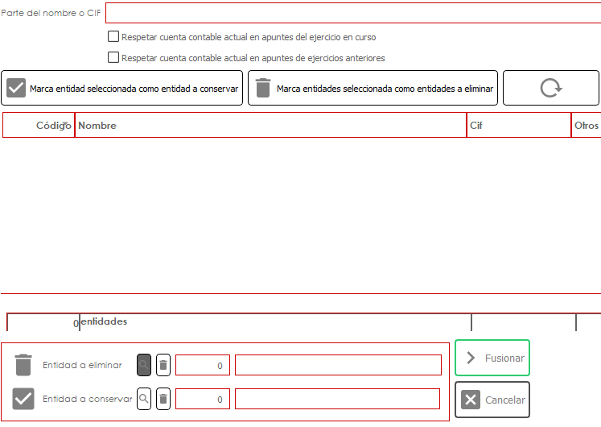
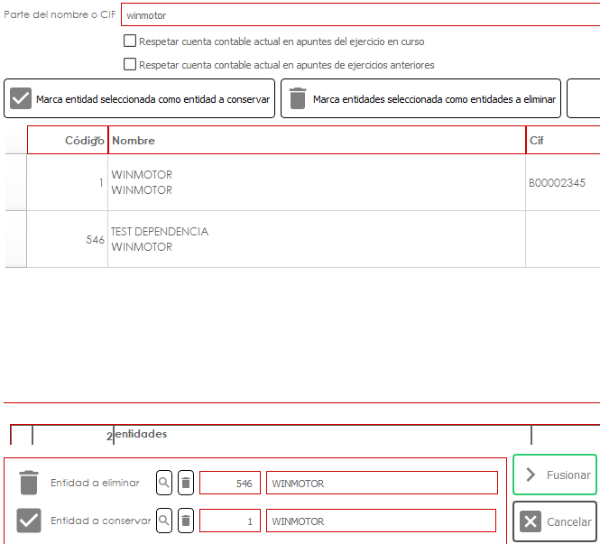

# Fusionar entidades

## Fusionar entidades

Esta opción sirve para la fusión de entidades y se localiza en el panel de entidades, opción F8

Esto quiere decir que los históricos de una entidad pasarán a otra entidad eliminando una de ellas. Esta opción será útil sobre todo en casos en los que haya dos entidades iguales y que solamente se quiera conservar una de ellas. Al fusionarlas existirá solamente una de ellas eliminando la que se quiere eliminar y habiendo pasado los históricos de la entidad eliminada a la entidad a conservar.

El panel se verá de la siguiente forma:

<figure><figcaption></figcaption></figure>

* Primero se indicará el nombre de la entidad a fusionar y saldrán automáticamente todas las que tengan ese nombre.
* Seguido habrá que seleccionar la entidad a dejar y pulsar el botón 'Marca entidad seleccionada como entidad a conservar' y después seleccionar la entidad a eliminar y pulsa el botón 'Marca entidades seleccionadas como entidades a eliminar':

<figure><figcaption></figcaption></figure>

* Por último, habrá que pulsar el botón de abajo 'Fusionar' e indicará en una ventana una pequeña indicación en la que se dice que no se traspasará la dirección ni la cuenta bancaria (seguirá teniendo la de la entidad a conservar).&#x20;

Una vez se acepte todo el histórico de la entidad eliminada pasa a la entidad que se conserva.
